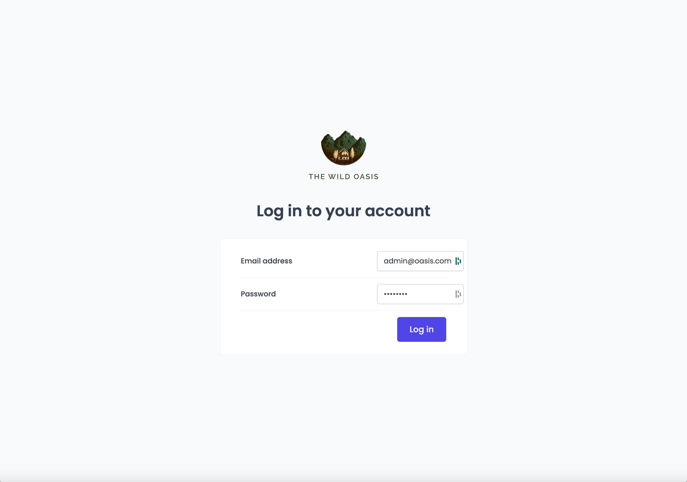
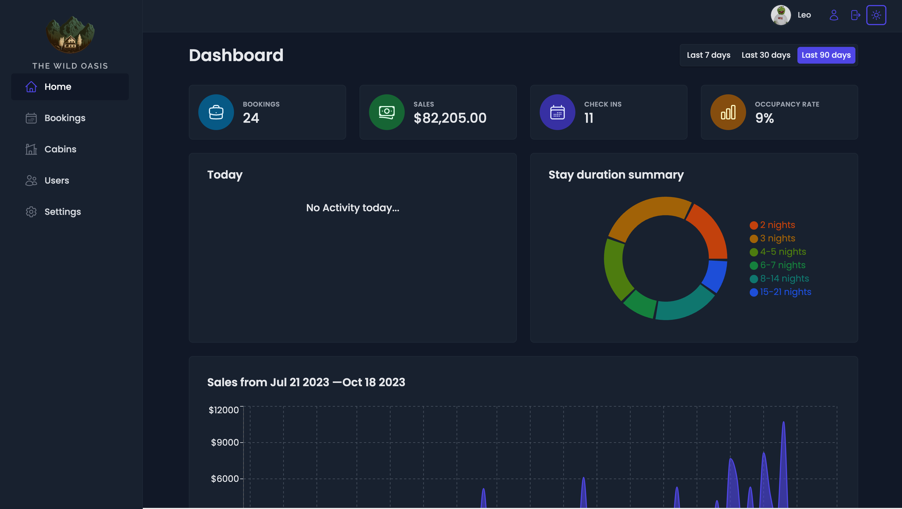
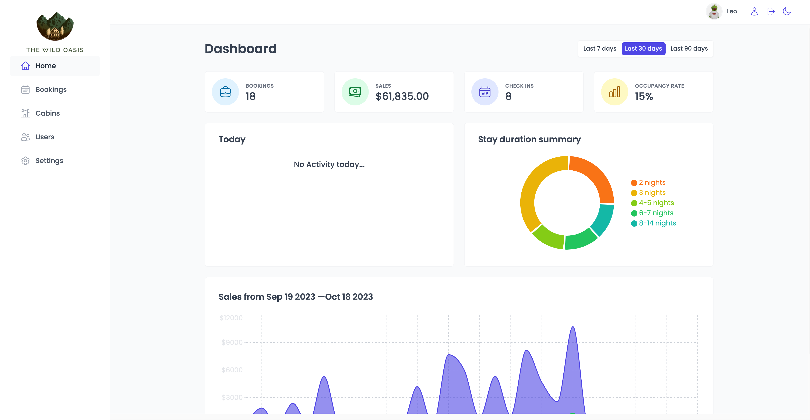
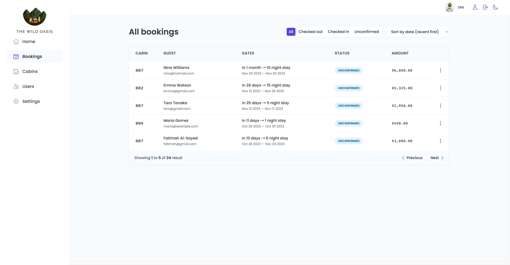
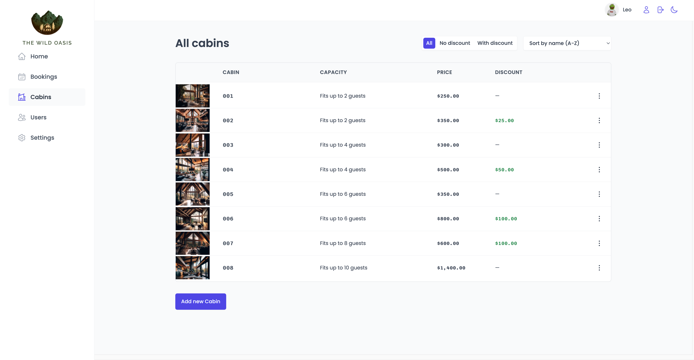
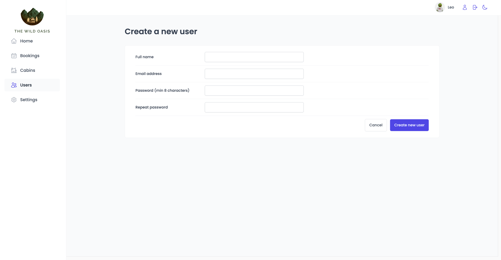
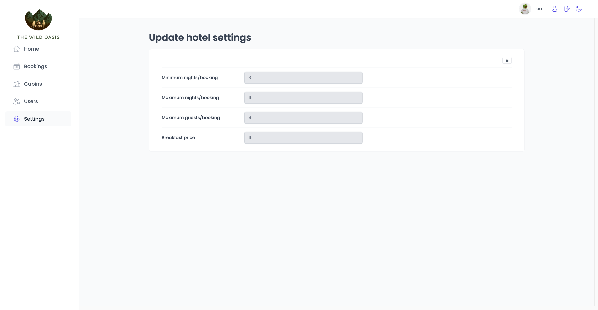

# The Wild Oasis

### [`Demo Link`](https://the-wild-oasis-web.netlify.app)

## Tech Stack

&nbsp;&nbsp;
&nbsp;&nbsp;
&nbsp;&nbsp;
&nbsp;&nbsp;
&nbsp;&nbsp;
&nbsp;&nbsp;
&nbsp;&nbsp;
&nbsp;&nbsp;

## Features

1. **User Authentication and Signup:**

   . Hotel employees can log in to the application to manage.
   . New users can only be signed up within the application to ensure that only hotel employees can create accounts.

2. **User Profile Management:**

   . Users can update their avatar name and password.
 

3. **Cabin Management:**
   
   . Users can update or delete existing cabins.
   . Users can create new cabins, including the ability to upload a photo.

4. **Booking Management:**

   . The table view displays booking information, including arrival and departure dates, booking status, paid amount, cabin details, and guest data.
   . Booking status can be "unconfirmed," "checked in," or "checked out."
   . The table view is filterable by booking status.
   . Additional booking data includes the number of guests, number of nights, guest observations, and whether breakfast was booked and its price.

5. **Booking Operations:**

   . Users can delete, check in, or check out a booking as the guest arrives.
   . On check-in, users can accept payment outside the app and then confirm the payment within the app.
   . Guests can add breakfast for the entire stay during check-in if they haven't already.

6. **Dashboard:**

   . The initial app screen serves as a dashboard displaying important information for the last 7, 30, or 90 days.
   . It shows a list of guests checking in and out on the current day, and users can perform tasks related to these activities from the dashboard.
   . The dashboard provides statistics on recent bookings, sales, check-ins, and occupancy rates.
   . It includes a chart showing all daily hotel sales, distinguishing between "total" sales and "extras" sales (only breakfast at present).
   . There's also a chart displaying statistics on stay durations, an important metric for the hotel.

7. **Application-wide Settings:**

   1. Users can define application-wide settings such as breakfast price, minimum and maximum nights per booking, and maximum guests per booking.

8. **Dark Mode:**
   1. The app includes a dark mode option for a different visual appearance and enhanced user experience in low-light conditions.

 
## Screenshots

-   #### Log In Page
  
    

-   #### Dark Mode

    

-   #### Dashboard Page

    

-   #### Bookings Page

    

-   #### Cabins Page

    

-   #### User Account Page

    

-   #### Settings Page

    

